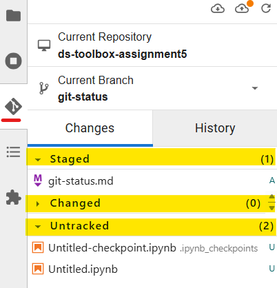

# Definition: git status  
The command `git status` allows us to quickly track our current workflow. It will also display the commands we can use to continue with our workflow.  
This corresponds to the left-side panel of JupyterLab IDE:  
 